 
## 查看主页获取源码

### 一、作品包含

源码+数据库+设计文档万字+PPT+全套环境和工具资源+部署教程

### 二、项目技术

前端技术：Html、Css、Js

数据库：MySQL

后端技术：Java、Spring Boot、MyBatis

  

### 三、运行环境

开发工具：IDEA

数据库：MySQL8.0

数据库管理工具：Navicat10以上版本

环境配置软件： JDK1.8+Maven3.6.3

### 四、项目介绍
项目编号：springbootA176

餐饮美食分享平台，作为一个汇聚美食爱好者的交流圣地，致力于为广大食客提供最新鲜、最热门的美食资讯。在这里，你可以发现各地特色美食，分享你的美食体验，交流烹饪技巧，还能结识志同道合的美食达人，一起探索美食世界的无限魅力。让我们共同打造一个充满美食诱惑、分享快乐、互动交流的美食天地！

前台用户功能：浏览首页、系统公告、菜谱、收藏、笔记、饮食资讯、趣味答题、进入后台系统。

后台分为管理员和用户
管理员的功能：系统首页、管理员信息、用户信息、菜谱大类信息、菜谱小类信息、菜谱信息、食材信息、收藏信息、笔记点赞信息、笔记信息、饮食资讯信息、公告信息、趣味答题信息、个人信息、笔记信息评论、修改密码、退出登录。
用户的功能：系统首页、菜谱信息、笔记信息、个人信息、笔记信息评论、修改密码、退出登录。

### 五、运行截图

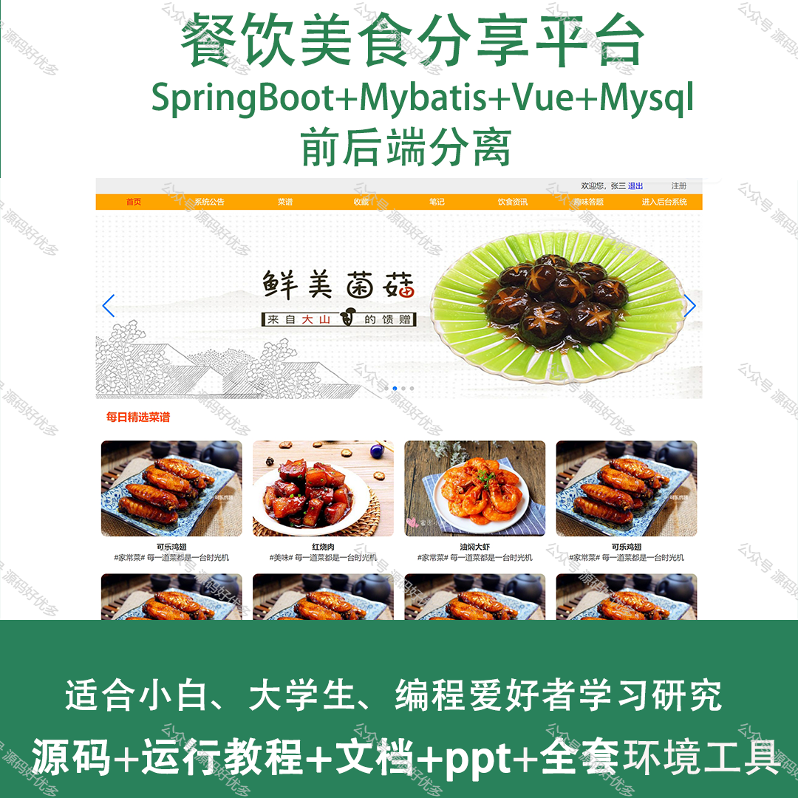
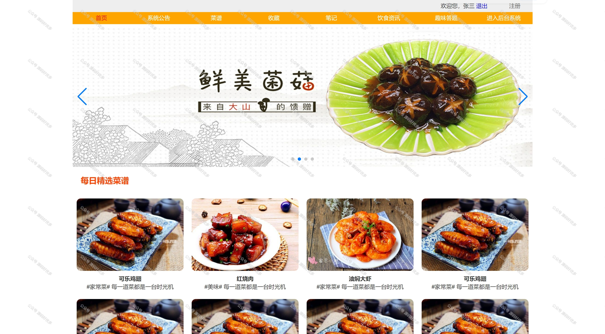
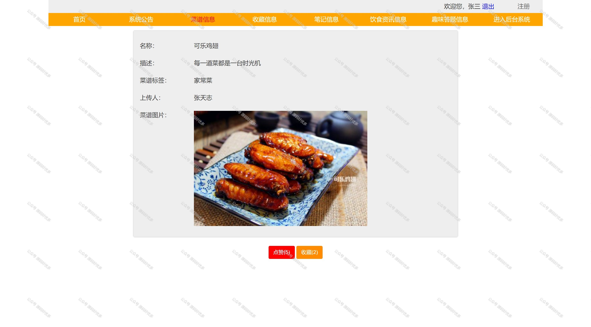
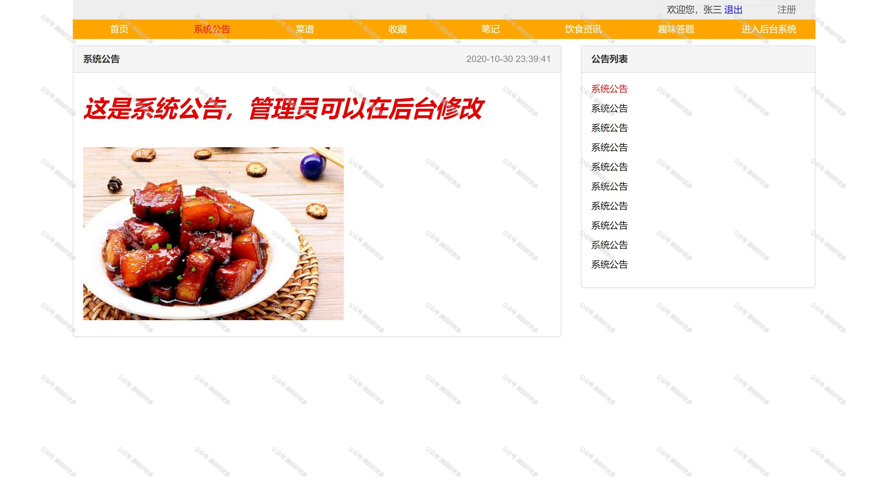
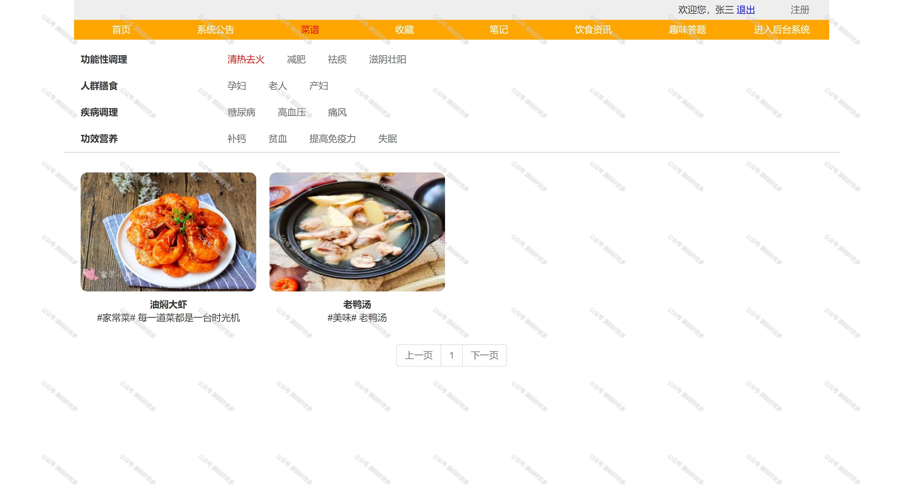
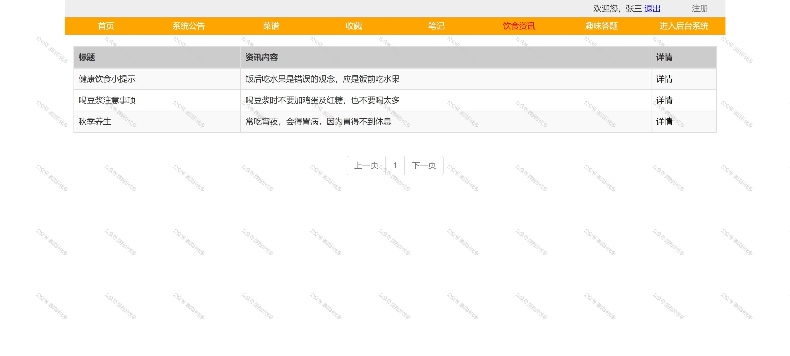
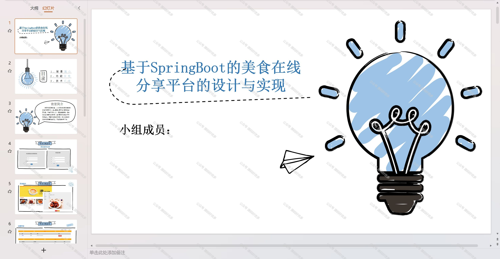
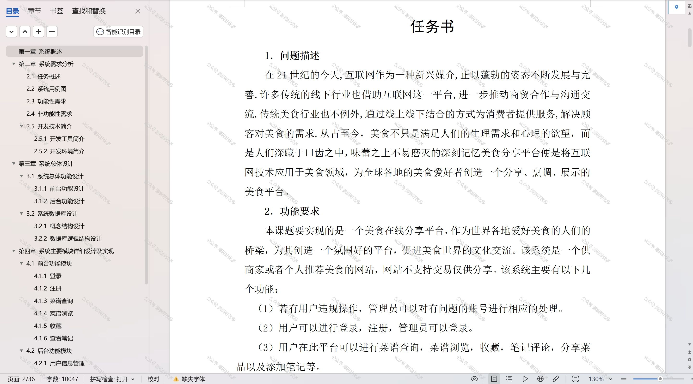
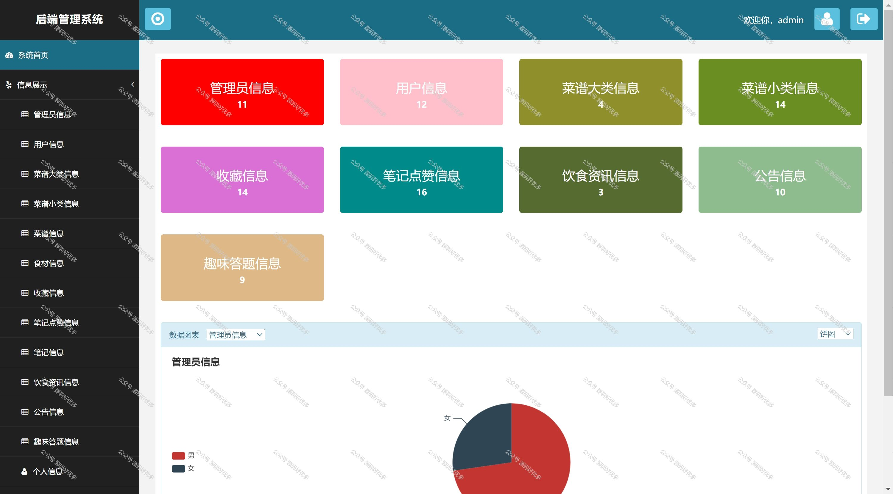
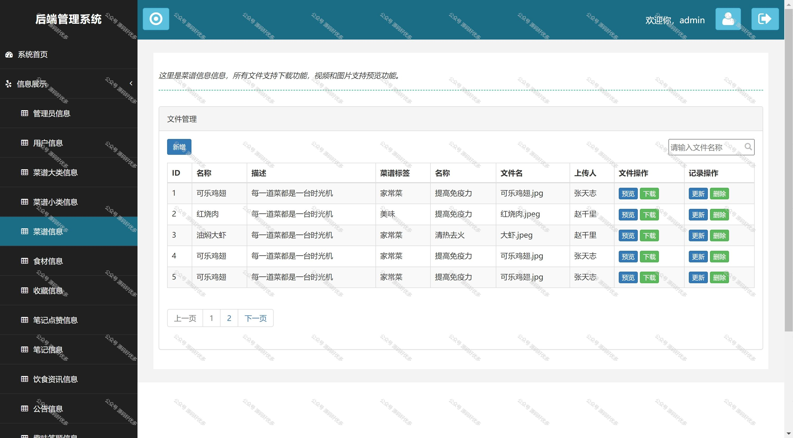
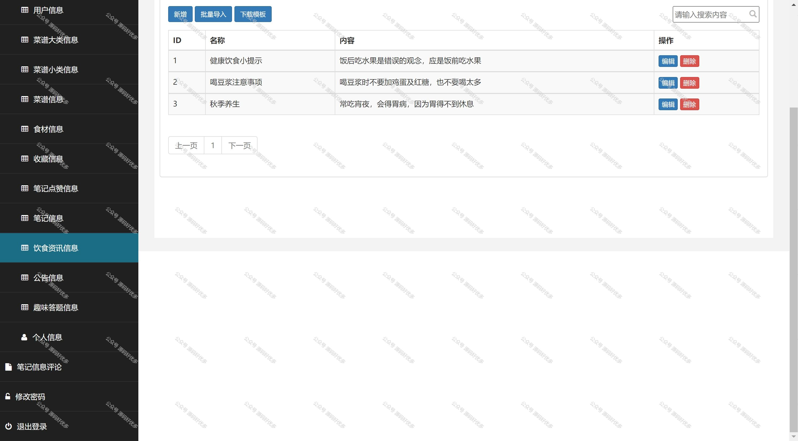

  
